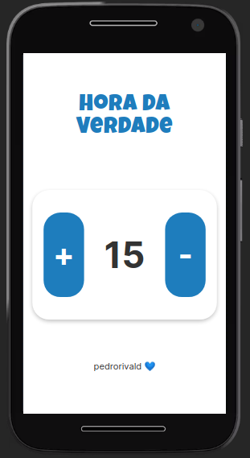

# Hora Da Verdade

### Contador de horas da verdade

Acessar: <a href="https://horadaverdade.vercel.app/">horadaverdade.vercel.app</a>

## :hammer: **Tecnologias Usadas** :wrench:
  
  
  
  
  

Projeto gerado com [Angular CLI](https://github.com/angular/angular-cli) versão 11.2.0.
